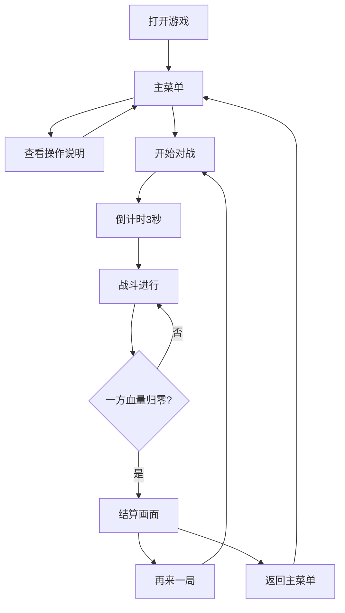

## 1. 产品概述

一款复古像素风格的浏览器端双人格斗小游戏。两名玩家各自操控一台机甲，在有限场景中进行移动、攻击、防御与技能释放，以削减对方血量至零为胜利目标。游戏强调即时反应与策略博弈，画面采用经典 8-bit/16-bit 像素美术风格，配合 CRT 扫描线效果，营造怀旧街机氛围。

## 2. 核心功能

### 2.1 用户角色
| 角色 | 说明 | 核心权限 |
|------|------|----------|
| 玩家1 | 本地键盘操控 | 控制左侧机甲（蓝方） |
| 玩家2 | 本地键盘操控 | 控制右侧机甲（红方） |

### 2.2 功能模块
1. **主菜单页**：游戏标题、开始对战按钮、操作说明、音效开关
2. **对战场景页**：像素风战斗场景、双机甲实时对战、血条与计时器、胜负结算
3. **结算页**：胜负结果展示、再来一局按钮、返回主菜单

### 2.3 页面详情
| 页面名称 | 模块名称 | 功能描述 |
|----------|----------|----------|
| 主菜单页 | 标题区 | 游戏 Logo 与像素风标题动画 |
| 主菜单页 | 操作区 | 开始游戏按钮、操作说明面板 |
| 对战场景页 | 场景层 | 像素风格背景、地面、远景装饰 |
| 对战场景页 | 角色层 | 两台机甲的渲染、动画、状态机 |
| 对战场景页 | UI层 | 血条、能量条、计时器、连击提示 |
| 结算页 | 结果展示 | 胜负文字、机甲立绘、统计信息 |

## 3. 核心流程

玩家打开游戏后进入主菜单，可选择查看操作说明或直接开始对战。对战开始后，双方机甲出现在场景两侧，进入倒计时。玩家通过键盘操控机甲进行移动、跳跃、普通攻击、防御和释放技能。当一方血量归零时，游戏结束并展示结算画面，玩家可选择再来一局或返回主菜单。

## 4. 用户界面设计

### 4.1 设计风格
- **主色调**：深蓝 (#1a1a2e) 作为背景主色，搭配亮蓝 (#00d4ff) 与赤红 (#ff2a6d) 作为双方机甲主题色
- **辅助色**：金色 (#ffd700) 用于高亮与特效，暗灰 (#4a4a5a) 用于UI边框
- **按钮风格**：像素边框 + 按下凹陷效果，hover 时颜色提亮
- **字体**：标题使用像素风格字体（Press Start 2P），正文使用等宽字体
- **布局**：战斗场景全屏居中，UI 元素悬浮于场景上方
- **特效风格**：CRT 扫描线覆盖层、像素粒子特效、屏幕震动

### 4.2 页面设计概览
| 页面名称 | 模块名称 | UI 元素 |
|----------|----------|---------|
| 主菜单页 | 背景 | 星空像素背景，缓慢滚动 |
| 主菜单页 | 标题 | Press Start 2P 字体，闪烁光标效果 |
| 主菜单页 | 按钮 | 像素边框矩形，hover 放大 1.05 倍 |
| 对战场景页 | 血条 | 顶部左右对称，红/蓝渐变色，带边框 |
| 对战场景页 | 机甲 | 32x32/48x48 像素精灵图，支持动画帧 |
| 对战场景页 | 特效 | 攻击轨迹、受击闪光、粒子飞溅 |
| 结算页 | 结果 | 大字号胜负文字，金色发光效果 |

### 4.3 响应式设计
- 桌面端优先，支持键盘操控
- 画布等比例缩放，保持像素清晰度
- 最小支持 800x600 分辨率

### 4.4 动画与特效指导
- **机甲待机动画**：2-4 帧循环，呼吸感上下浮动
- **移动动画**：4-6 帧行走循环
- **攻击动画**：3-5 帧，带武器轨迹残影
- **受击动画**：闪烁 + 击退 + 粒子飞溅
- **技能释放**：全屏闪光 + 大型粒子特效 + 屏幕震动
- **CRT 效果**：扫描线 + 轻微画面弯曲 + 噪点
