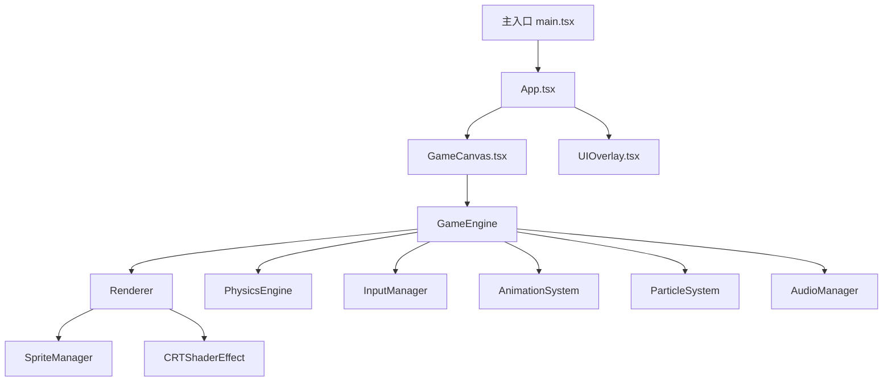

## 1. 架构设计



## 2. 技术描述

- **前端框架**：React 18 + TypeScript
- **构建工具**：Vite
- **样式方案**：Tailwind CSS + 自定义 CSS（像素风格）
- **游戏渲染**：HTML5 Canvas 2D API（像素 perfect 渲染）
- **状态管理**：Zustand（游戏状态、UI 状态）
- **动画系统**：基于 requestAnimationFrame 的自定义动画循环
- **音频**：Web Audio API 生成 8-bit 风格音效
- **字体**：Google Fonts - Press Start 2P

## 3. 路由定义

| 路由 | 用途 |
|------|------|
| / | 主菜单页 |
| /game | 对战场景页 |
| /result | 结算页 |

## 4. 数据结构

### 4.1 机甲数据模型
```typescript
interface Mech {
  id: string;
  name: string;
  x: number;
  y: number;
  width: number;
  height: number;
  velocityX: number;
  velocityY: number;
  hp: number;
  maxHp: number;
  energy: number;
  maxEnergy: number;
  facing: 'left' | 'right';
  state: MechState;
  team: 'blue' | 'red';
}

type MechState = 'idle' | 'walk' | 'jump' | 'attack' | 'defend' | 'hit' | 'skill' | 'dead';
```

### 4.2 游戏状态
```typescript
interface GameState {
  phase: 'menu' | 'countdown' | 'fighting' | 'paused' | 'ended';
  mechs: [Mech, Mech];
  timer: number;
  winner: string | null;
  comboCount: number;
}
```

### 4.3 输入映射
| 玩家 | 左移 | 右移 | 跳跃 | 攻击 | 防御 | 技能 |
|------|------|------|------|------|------|------|
| 玩家1 (蓝方) | A | D | W | J | K | L |
| 玩家2 (红方) | ← | → | ↑ | 1 | 2 | 3 |

## 5. 核心系统说明

### 5.1 游戏循环
- 使用 requestAnimationFrame 驱动
- 固定时间步长更新（60 FPS）
- 分离渲染与逻辑更新

### 5.2 碰撞检测
- AABB（轴对齐边界框）碰撞检测
- 攻击判定框与受击框分离

### 5.3 动画系统
- 精灵图帧动画管理
- 状态机驱动动画切换
- 支持动画回调（攻击命中判定等）

### 5.4 粒子系统
- 简单的粒子发射器
- 支持位置、速度、生命周期、颜色配置
- 用于受击、技能、地面灰尘等特效

### 5.5 音频系统
- 使用 Web Audio API 合成 8-bit 音效
- 支持 BGM 循环播放
- 音效：攻击、受击、跳跃、技能、胜利/失败
